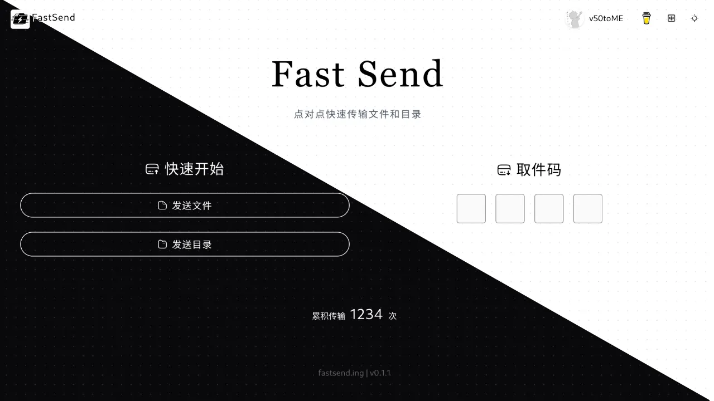

<h1 align="center">ShareYouSee 文件快传 🚀</h1>

<p align="center">
  
  <a href="#" target="_blank">
    
  </a>
</p>

<p align="center">
  
</p>

## 📖 项目介绍

ShareYouSee 是一个基于 WebRTC 技术的点对点文件传输工具，支持快速的目录同步和文件传输。通过浏览器即可实现安全、高效的文件共享。

🌐 在线体验：[share.armin.com.cn](https://share.armin.com.cn)

## ✨ 特性

- 🔒 点对点加密传输，确保数据安全
- 📁 支持文件和文件夹传输
- 🚀 局域网自动优化，传输更快
- 🎯 简单易用的界面设计
- 🌍 支持中英文界面
- 📲 支持PWA轻量安装
- 🔐 基于 BIP39 助记词的身份系统(联系人 / 群组 / 定向推送)

## 🛠️ 技术栈

- WebRTC + Modern File System API
- Vue 3 (Composition API) + Vite
- Pinia (状态管理)
- TypeScript
- PrimeVue 4 (unstyled + Aura PassThrough)
- Tailwind CSS
- Fastify + Bun(后端 WebSocket 信令 + REST)
- @fastify/websocket(WebSocket 信令通道)
- vue-i18n(中英双语)
- vite-plugin-pwa(PWA + workbox)

## 🗂️ 目录结构(前后端分离)

```
shareyousee/
├── frontend/                 # Vue 3 + Vite SPA 前端
│   ├── src/
│   │   ├── views/            # 路由页面
│   │   ├── components/       # UI 组件(零修改平移)
│   │   ├── stores/           # Pinia 状态(零修改平移)
│   │   ├── composables/      # 组合式逻辑(含 usePresenceWs 全局 ws)
│   │   ├── utils/            # 工具(PeerDataChannel / wallet / files)
│   │   ├── types/            # 类型定义 + global.d.ts
│   │   ├── locales/          # vue-i18n 中英双语文案
│   │   ├── presets/aura/     # PrimeVue Aura PT 主题
│   │   ├── styles/main.css   # 全局 CSS(Tailwind + PrimeVue unstyled 变量)
│   │   ├── router/index.ts   # Vue Router 4 显式路由表
│   │   ├── App.vue           # 根组件
│   │   ├── main.ts           # 应用入口
│   │   ├── components/
│   │   │   ├── ClientOnly.vue # ClientOnly 组件(SPA 兼容)
│   │   │   └── Icon.vue       # Icon 组件(collection:name 格式)
│   │   └── utils/
│   │       ├── colorMode.ts  # 暗色模式
│   │       ├── localePath.ts # useLocalePath
│   │       ├── seoMeta.ts    # useSeoMeta(no-op)
│   │       └── useState.ts   # useState(module Map shim)
│   ├── public/               # 静态资源 + PWA sw.js + manifest
│   ├── vite.config.ts        # Vite + PWA + unplugin-icons 配置
│   └── package.json
├── backend/                  # Fastify + Bun 后端
│   ├── src/
│   │   ├── server.ts         # Fastify 入口
│   │   ├── ws/
│   │   │   ├── connect.ts    # WebSocket 信令(取件码配对 + Push 协议)
│   │   │   └── presence.ts   # 在线状态 + 定向推送注册表
│   │   └── utils/
│   │       └── TransCount.ts # 全局传输计数(本地文件持久化)
│   └── Dockerfile
├── Caddyfile                 # 反代配置(前端静态 + /api/* 反代到后端)
├── docker-compose.yaml
├── scripts/
│   └── package-deploy.sh     # 打包前后端分离产物
├── AGENTS.md                 # Agent 维护约束
└── README.md
```

## 📦 安装与构建

```bash
# 后端
cd backend && bun install && bun run build

# 前端
cd frontend && bun install && bun run build
```

## 🚀 本地开发

```bash
# 启动后端(端口 3002)
cd backend && bun run dev

# 启动前端(另一终端, 端口 5173)
cd frontend && bun run dev
```

Vite 已配置 `/api` 反代到 `http://127.0.0.1:3002`,前端访问 `http://localhost:5173` 即可联调完整流程。

## 🌐 部署

### 反向代理 + 静态托管(推荐)

```bash
# 1. 构建产物
cd frontend && bun run build       # → frontend/dist/
cd backend && bun run build        # → backend/dist/

# 2. 上传到服务器
scp -r frontend/dist user@host:/var/www/shareyousee/frontend-dist
scp -r backend/dist user@host:/var/www/shareyousee/backend/dist
scp -r backend/node_modules user@host:/var/www/shareyousee/backend/

# 3. 启动后端
ssh user@host 'cd /var/www/shareyousee/backend && PORT=3002 bun run dist/server.js'

# 4. 配置 Caddy(见仓库 Caddyfile)
```

### 一键打包

```bash
./scripts/package-deploy.sh
# 生成 dist/shareyousee-output.tar.gz,包含 frontend-dist + backend/dist + node_modules
```

### Docker(后端容器 + 前端静态)

```bash
docker compose up -d
# 后端监听 3002,前端 dist 挂载到 /app/public-dist 由 Fastify serve
# 生产场景建议:仅部署后端容器,前端静态资源由 Caddy 直托管
```

> [!IMPORTANT]
>
> 目录传输和同步需要 `HTTPS` 以及浏览器支持,一般新版本的桌面浏览器都支持
>
> 本项目自身的 HTTPS 配置方式(测试环境)请参考:
>
> - [Nuxt 部署教程(英文)](https://nuxt.com/docs/4.x/getting-started/deployment#entry-point)
>
> ShareYouSee 不建议直接以 HTTPS 形式进行生产环境部署,而应当位于反向代理服务器之后,请参考:
>
> - [Nginx](https://nginx.org/en/docs/http/configuring_https_servers.html)
> - [Apache httpd](https://httpd.apache.org/docs/current/ssl/)
> - [Caddy](https://caddyserver.com/docs/quick-starts/https)
> - [Windows IIS](https://learn.microsoft.com/zh-cn/iis/manage/configuring-security/how-to-set-up-ssl-on-iis)

## 🐳 Docker 镜像

> [!CAUTION]
>
> `shouchenicu/fastsend` 是此项目在 Docker Hub 上的 **唯一** 官方镜像!
>
> 当前已发现 12 个第三方镜像,其中5个[^1]的下载使用量高于官方镜像。请注意甄别,风险自负!

[^1]: 比如 `niliaerith/fastsend`

```bash
# 后端镜像(已发布)
docker run -d --name fastsend -p 3002:3002 shouchenicu/fastsend:latest
```

## 💡 使用提示

1. 确保浏览器启用了 WebRTC 功能
2. 如需传输文件夹或同步目录,请确保浏览器支持现代文件系统 API 并已启用 HTTPS 传输
3. 在同一局域网内传输速度最快
4. 建议在网络状态良好时使用,部分网络环境可能会阻止 P2P / WebRTC 正确建立连接,从而导致传输失败

## 👨‍💻 作者

**ShouChen**

- 博客: [shouchen.blog](https://shouchen.blog)
- X: [@ShouChen\_](https://x.com/ShouChen_)

## 🤝 贡献

欢迎提交 Issue 和 Pull Request！

## 📝 开源协议

本项目基于 MIT 协议开源。

## ⭐ 支持项目

如果这个项目对你有帮助,欢迎给一个 star 支持一下!
